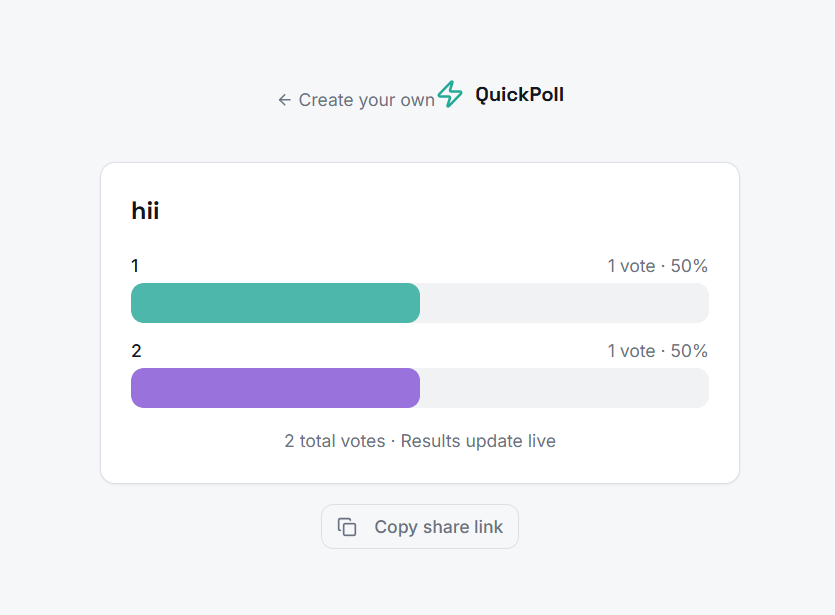
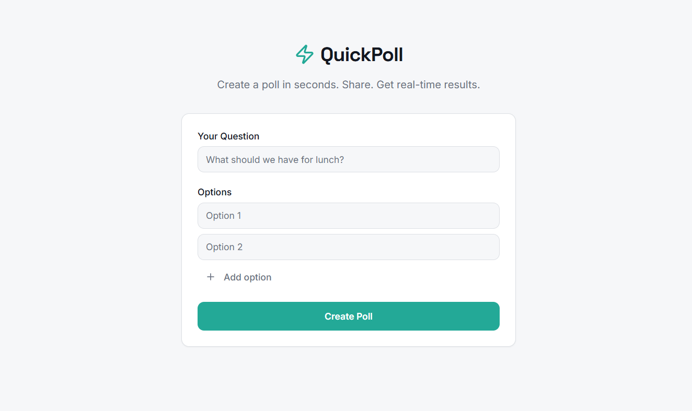

# 🚀 QuickPoll

QuickPoll is a real-time polling web application built using React, Vite, TypeScript, and Supabase.

Users can create polls, share links, and see live vote updates instantly.

---

## 🌐 Live Demo

👉 https://quick-poll-beta.vercel.app

---

## 📸 Screenshots

### 🏠 Create Poll Page


### 📊 Live Results Page


---

## ✨ Features

- 🗳 Create polls with multiple options
- 🔗 Share poll via unique link
- ⚡ Real-time vote updates (Supabase Realtime)
- 🔐 Duplicate vote protection (browser fingerprint)
- 📊 Live percentage-based results
- 🎨 Clean UI with Tailwind & shadcn

---

## 🛠 Tech Stack

- React + TypeScript
- Vite
- Supabase (Database + Realtime)
- Tailwind CSS
- React Router

---

## 📦 Installation

Clone the repo:

```bash
git clone https://github.com/rajeevroy21/QuickPoll.git
cd QuickPoll
